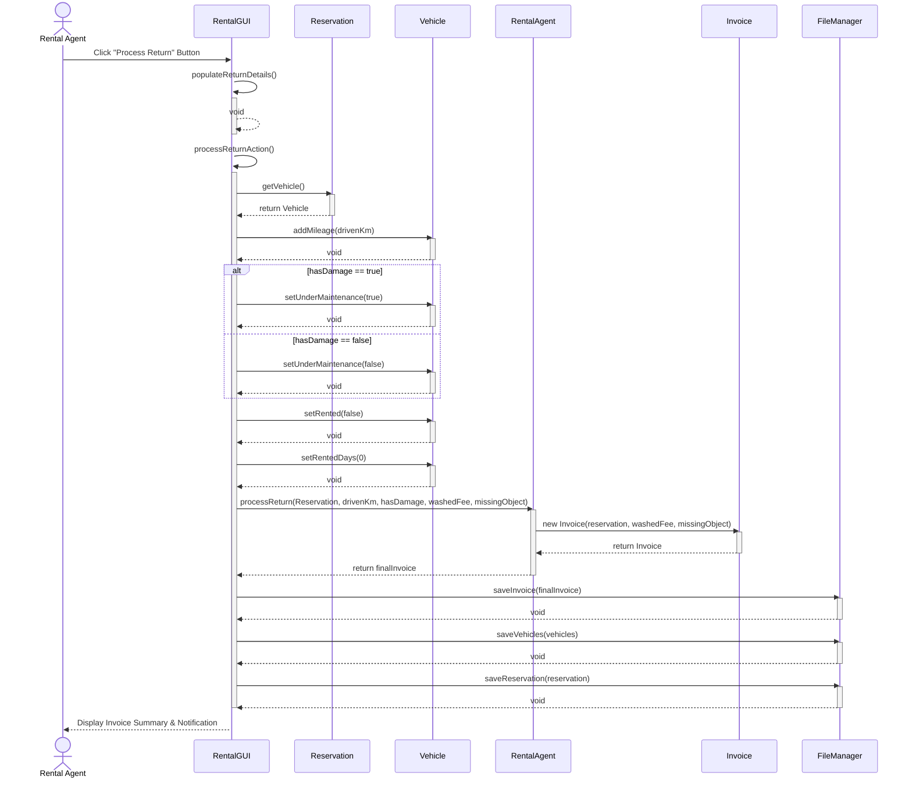

```mermaid

sequenceDiagram
    actor User as Rental Agent
    participant GUI as RentalGUI
    participant Res as Reservation
    participant Veh as Vehicle
    participant RA as RentalAgent
    participant Inv as Invoice
    participant DB as FileManager

    User->>GUI: Click "Process Return" Button
    activate GUI
    
    GUI->>GUI: populateReturnDetails()
    activate GUI
    GUI-->>GUI: void
    deactivate GUI
    
    GUI->>GUI: processReturnAction()
    activate GUI
    
    GUI->>Res: getVehicle()
    activate Res
    Res-->>GUI: return Vehicle
    deactivate Res
    
    GUI->>Veh: addMileage(drivenKm)
    activate Veh
    Veh-->>GUI: void
    deactivate Veh
    
    alt hasDamage == true
        GUI->>Veh: setUnderMaintenance(true)
        activate Veh
        Veh-->>GUI: void
        deactivate Veh
    else hasDamage == false
        GUI->>Veh: setUnderMaintenance(false)
        activate Veh
        Veh-->>GUI: void
        deactivate Veh
    end
    
    GUI->>Veh: setRented(false)
    activate Veh
    Veh-->>GUI: void
    deactivate Veh
    
    GUI->>Veh: setRentedDays(0)
    activate Veh
    Veh-->>GUI: void
    deactivate Veh
    
    GUI->>RA: processReturn(Reservation, drivenKm, hasDamage, washedFee, missingObject)
    activate RA
    
    RA->>Inv: new Invoice(reservation, washedFee, missingObject)
    activate Inv
    Inv-->>RA: return Invoice
    deactivate Inv
    
    RA-->>GUI: return finalInvoice
    deactivate RA
    
    GUI->>DB: saveInvoice(finalInvoice)
    activate DB
    DB-->>GUI: void
    deactivate DB
    
    GUI->>DB: saveVehicles(vehicles)
    activate DB
    DB-->>GUI: void
    deactivate DB
    
    GUI->>DB: saveReservation(reservation)
    activate DB
    DB-->>GUI: void
    deactivate DB
    
    deactivate GUI
    
    GUI-->>User: Display Invoice Summary & Notification
```