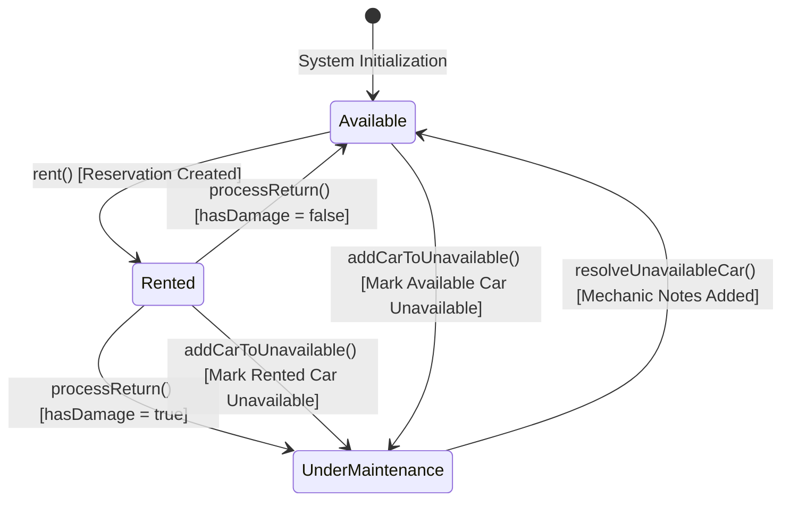

```mermaid

stateDiagram-v2
    [*] --> Available : System Initialization
    
    Available --> Rented : rent() [Reservation Created]
    Rented --> Available : processReturn() [hasDamage = false]
    
    Rented --> UnderMaintenance : processReturn() [hasDamage = true]
    Rented --> UnderMaintenance : addCarToUnavailable() [Mark Rented Car Unavailable]
    Available --> UnderMaintenance : addCarToUnavailable() [Mark Available Car Unavailable]
    
    UnderMaintenance --> Available : resolveUnavailableCar() [Mechanic Notes Added]
```