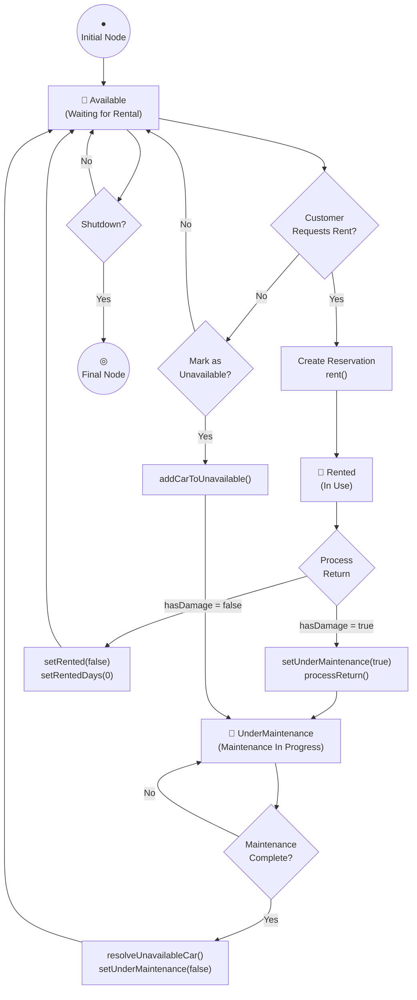

```mermaid

graph TD
    Start(("●<br/>Initial Node"))
    
    Start --> AvailableState["📍 Available<br/>(Waiting for Rental)"]
    
    AvailableState --> RentalDecision{"Customer<br/>Requests Rent?"}
    RentalDecision -->|Yes| CreateReservation["Create Reservation<br/>rent()"]
    RentalDecision -->|No| MarkUnavailableDecision1{"Mark as<br/>Unavailable?"}
    
    CreateReservation --> RentedState["📍 Rented<br/>(In Use)"]
    
    RentedState --> ReturnDecision{"Process<br/>Return"}
    ReturnDecision -->|hasDamage = true| SetMaintenance1["setUnderMaintenance(true)<br/>processReturn()"]
    ReturnDecision -->|hasDamage = false| ReturnToAvailable["setRented(false)<br/>setRentedDays(0)"]
    
    MarkUnavailableDecision1 -->|Yes| SetMaintenance2["addCarToUnavailable()"]
    MarkUnavailableDecision1 -->|No| AvailableState
    
    SetMaintenance1 --> UnderMaintenanceState["📍 UnderMaintenance<br/>(Maintenance In Progress)"]
    SetMaintenance2 --> UnderMaintenanceState
    
    ReturnToAvailable --> AvailableState
    
    UnderMaintenanceState --> ResolveDecision{"Maintenance<br/>Complete?"}
    ResolveDecision -->|Yes| ResolveMaintenance["resolveUnavailableCar()<br/>setUnderMaintenance(false)"]
    ResolveDecision -->|No| UnderMaintenanceState
    
    ResolveMaintenance --> AvailableState
    
    AvailableState --> EndDecision{"Shutdown?"}
    EndDecision -->|Yes| End(("◎<br/>Final Node"))
    EndDecision -->|No| AvailableState
```