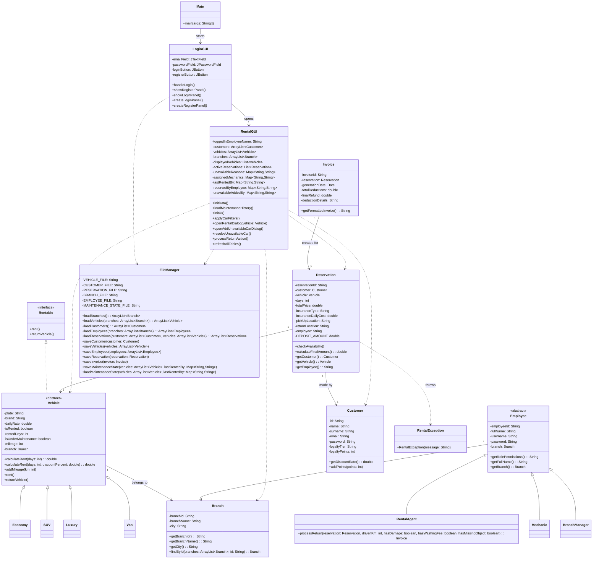

```mermaid

classDiagram
    class Rentable {
        <<interface>>
        +rent()
        +returnVehicle()
    }

    class Vehicle {
        <<abstract>>
        -plate: String
        -brand: String
        -dailyRate: double
        -isRented: boolean
        -rentedDays: int
        -isUnderMaintenance: boolean
        -mileage: int
        -branch: Branch
        +calculateRent(days: int): double
        +calculateRent(days: int, discountPercent: double): double
        +addMileage(km: int)
        +rent()
        +returnVehicle()
    }

    class Economy
    class SUV
    class Luxury
    class Van

    class Employee {
        <<abstract>>
        -employeeId: String
        -fullName: String
        -username: String
        -password: String
        -branch: Branch
        +getRolePermissions(): String
        +getFullName(): String
        +getBranch(): Branch
    }

    class RentalAgent {
        +processReturn(reservation: Reservation, drivenKm: int, hasDamage: boolean, hasWashingFee: boolean, hasMissingObject: boolean): Invoice
    }
    class Mechanic
    class BranchManager

    class Customer {
        -id: String
        -name: String
        -surname: String
        -email: String
        -password: String
        -loyaltyTier: String
        -loyaltyPoints: int
        +getDiscountRate(): double
        +addPoints(points: int)
    }

    class Reservation {
        -reservationId: String
        -customer: Customer
        -vehicle: Vehicle
        -days: int
        -totalPrice: double
        -insuranceType: String
        -insuranceDailyCost: double
        -pickUpLocation: String
        -returnLocation: String
        -employee: String
        -DEPOSIT_AMOUNT: double
        +checkAvailability()
        +calculateFinalAmount(): double
        +getCustomer(): Customer
        +getVehicle(): Vehicle
        +getEmployee(): String
    }

    class Invoice {
        -invoiceId: String
        -reservation: Reservation
        -generationDate: Date
        -totalDeductions: double
        -finalRefund: double
        -deductionDetails: String
        +getFormattedInvoice(): String
    }

    class Branch {
        -branchId: String
        -branchName: String
        -city: String
        +getBranchId(): String
        +getBranchName(): String
        +getCity(): String
        +findById(branches: ArrayList~Branch~, id: String): Branch
    }

    class FileManager {
        -VEHICLE_FILE: String
        -CUSTOMER_FILE: String
        -RESERVATION_FILE: String
        -BRANCH_FILE: String
        -EMPLOYEE_FILE: String
        -MAINTENANCE_STATE_FILE: String
        +loadBranches(): ArrayList~Branch~
        +loadVehicles(branches: ArrayList~Branch~): ArrayList~Vehicle~
        +loadCustomers(): ArrayList~Customer~
        +loadEmployees(branches: ArrayList~Branch~): ArrayList~Employee~
        +loadReservations(customers: ArrayList~Customer~, vehicles: ArrayList~Vehicle~): ArrayList~Reservation~
        +saveCustomer(customer: Customer)
        +saveVehicles(vehicles: ArrayList~Vehicle~)
        +saveEmployees(employees: ArrayList~Employee~)
        +saveReservation(reservation: Reservation)
        +saveInvoice(invoice: Invoice)
        +saveMaintenanceState(vehicles: ArrayList~Vehicle~, unavailableReasons: Map~String,String~, assignedMechanics: Map~String,String~, unavailableAddedBy: Map~String,String~, lastRentedBy: Map~String,String~)
        +loadMaintenanceState(vehicles: ArrayList~Vehicle~, unavailableReasons: Map~String,String~, assignedMechanics: Map~String,String~, unavailableAddedBy: Map~String,String~, lastRentedBy: Map~String,String~)
    }

    class RentalException {
        +RentalException(message: String)
    }

    class LoginGUI {
        -emailField: JTextField
        -passwordField: JPasswordField
        -loginButton: JButton
        -registerButton: JButton
        +handleLogin()
        +showRegisterPanel()
        +showLoginPanel()
        +createLoginPanel()
        +createRegisterPanel()
    }

    class RentalGUI {
        -loggedInEmployeeName: String
        -customers: ArrayList~Customer~
        -vehicles: ArrayList~Vehicle~
        -branches: ArrayList~Branch~
        -displayedVehicles: List~Vehicle~
        -activeReservations: List~Reservation~
        -unavailableReasons: Map~String,String~
        -assignedMechanics: Map~String,String~
        -lastRentedBy: Map~String,String~
        -reservedByEmployee: Map~String,String~
        -unavailableAddedBy: Map~String,String~
        +initData()
        +loadMaintenanceHistory()
        +initUI()
        +applyCarFilters()
        +openRentalDialog(vehicle: Vehicle)
        +openAddUnavailableCarDialog()
        +resolveUnavailableCar()
        +processReturnAction()
        +refreshAllTables()
    }

    class Main {
        +main(args: String[])
    }

    Rentable <|.. Vehicle
    Vehicle <|-- Economy
    Vehicle <|-- SUV
    Vehicle <|-- Luxury
    Vehicle <|-- Van

    Employee <|-- RentalAgent
    Employee <|-- Mechanic
    Employee <|-- BranchManager

    Vehicle "1" --> "1" Branch : belongs to
    Employee "*" --> "1" Branch : works at
    Reservation "1" --> "1" Customer : made by
    Reservation "1" --> "1" Vehicle : reserves
    Invoice "1" --> "1" Reservation : created for
    Reservation ..> RentalException : throws

    LoginGUI ..> FileManager
    LoginGUI --> RentalGUI : opens
    RentalGUI ..> FileManager
    RentalGUI ..> Reservation
    RentalGUI ..> Vehicle
    RentalGUI ..> Customer
    RentalGUI ..> Branch
    Main --> LoginGUI : starts
```